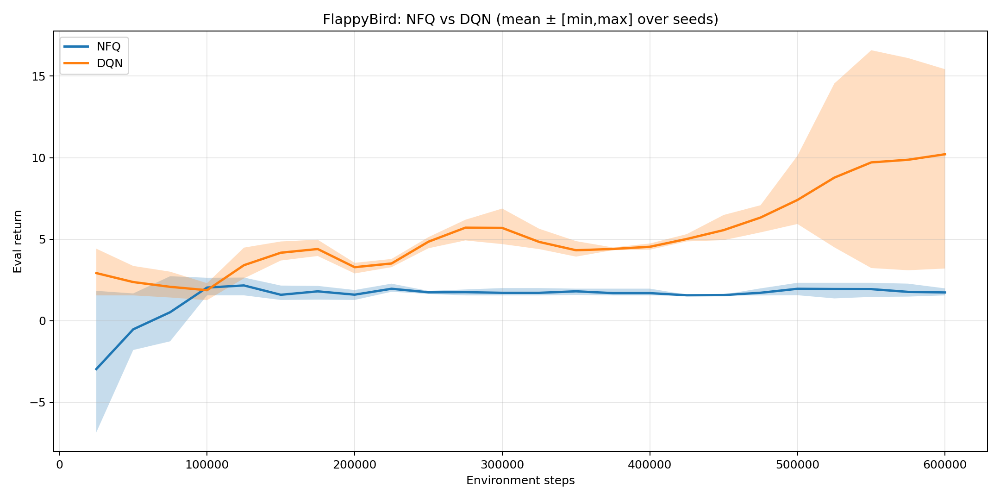
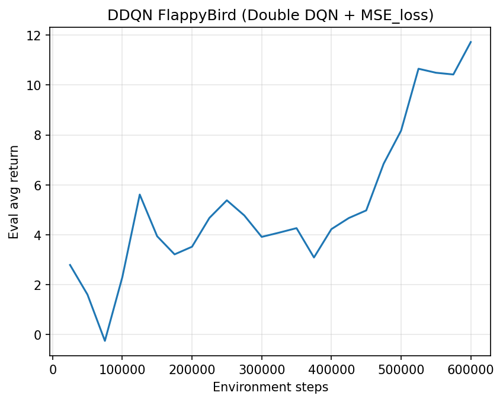

# Reinforcement Learning for Flappy Bird
Neural Fitted Q-Iteration, DQN and Double DQN

<p align="center">
    
</p>

## Purpose of the Project

This repository collects a set of reinforcement learning agents developed to study and compare value-based learning algorithms in a controlled environment.  
The project was carried out as part of an academic reinforcement learning assignment and focuses on the implementation, training, and evaluation of different approaches for learning control policies from interaction.

The main objective is to analyze how classical Deep Q-Learning methods and batch reinforcement learning techniques behave when applied to the same task, under comparable experimental conditions. In particular, the project investigates the impact of algorithmic choices on learning stability, sample efficiency, and final performance.

To this end, three algorithms are implemented and compared:
- Neural Fitted Q-Iteration (NFQ),
- Deep Q-Network (DQN),
- Double Deep Q-Network (DDQN).

All agents are trained on the same environment and share a common network architecture and reward structure, allowing for a fair and systematic comparison.  
Beyond implementation, the project emphasizes reproducibility and experimental analysis, including multi-seed evaluation, aggregated performance metrics, and visual inspection of learning dynamics.

## Problem Description and Environment

The considered task is the classic Flappy Bird game, formulated as a reinforcement learning control problem.  
The agent controls a bird that moves horizontally at constant speed and must decide when to flap in order to avoid colliding with vertical pipes and the ground.

The environment is episodic and stochastic, with each episode starting from an initial configuration and terminating upon collision with an obstacle or the environment boundaries. The objective of the agent is to survive for as long as possible by maintaining a safe trajectory through the gaps between pipes.

All experiments are conducted using the `FlappyBird-v0` environment provided by the `flappy-bird-gymnasium` package and wrapped within the Gymnasium interface. The environment exposes a low-dimensional continuous state representation and a discrete action space, making it suitable for value-based reinforcement learning methods with function approximation.

No modifications are applied to the environment dynamics. However, a mild reward shaping term is introduced to encourage longer survival and stabilize learning, while preserving the original structure of the task.


## Reinforcement Learning Formulation

The Flappy Bird task is defined by a state space, an action space, a reward function, and a policy governing the agent’s behavior during training and evaluation.

### State Representation

At each time step, the agent observes a low-dimensional continuous state vector provided by the environment. The state encodes the relative position and velocity of the bird with respect to the next obstacle, capturing the information necessary to make control decisions.

The observation is converted into a one-dimensional `float32` vector and lightly clipped to avoid numerical instabilities. No additional feature engineering or frame stacking is applied.

### Action Space

The action space is discrete and consists of two possible actions:
- **0**: do nothing (no flap),
- **1**: apply an upward flap impulse.

This formulation results in a simple binary control problem.

### Reward Function

The environment provides a sparse reward signal associated with progression through the episode and episode termination upon collision.  
To encourage stable learning and longer survival, a small positive shaping reward is added at each non-terminal step. This shaping term promotes smoother exploration while preserving the original objective of the task.

At each time step the agent receives:
- a positive reward when a pipe is successfully passed (reward = +1, it's provided by the environment),
- an additional small survival reward for each non-terminal transition (survival_reward: float = 0.05).
  This shaping term is designed to encourage longer survival and to mitigate the difficulty of long-horizon credit assignment, while remaining secondary with respect to the primary task reward.

  N.b. Preliminary experiments showed that using an excessively large survival reward led to undesired behaviors, with the agent prioritizing survival time over successfully passing pipes. This resulted in policies that avoided risk without achieving the main task objective. For this reason, the survival reward was progressively reduced and set to a sufficiently small value to act only as a learning aid rather than a dominant objective.

No explicit terminal reward is introduced, and episode termination corresponds exclusively to failure states.

### Policy

During training, the agent follows an ε-greedy behavior policy derived from the learned action-value function. Exploration is controlled through:
- a decaying ε schedule for DQN and Double DQN,
- a fixed ε for Neural Fitted Q-Iteration, consistent with a batch reinforcement learning setting.

During evaluation, the policy is purely greedy with respect to the learned Q-function.

## Algorithmic Approaches

### Neural Fitted Q-Iteration (NFQ)

Neural Fitted Q-Iteration (NFQ) is a batch reinforcement learning algorithm that extends classical Q-learning by using a neural network to approximate the action-value function over a continuous state space. Rather than performing incremental online updates, NFQ alternates between data collection and supervised learning phases, framing value estimation as a regression problem.

In this implementation, the Q-function is approximated by a fully connected neural network that takes the state as input and outputs Q-values for all available actions. Training data consists of batches of transition tuples (s, a, r, s′, done) collected through interaction with the environment.

During data collection, an ε-greedy behavior policy is employed to balance exploration and exploitation. The exploration rate ε is kept fixed throughout training, in line with the batch-oriented nature of NFQ, ensuring sufficient coverage of the state–action space during experience gathering.

For each batch of collected transitions, target Q-values are computed using a temporal-difference bootstrap rule with a fixed target within each iteration. The network parameters are optimized by minimizing the mean squared temporal-difference error over multiple training epochs using a gradient-based optimizer.

Training is performed over a predefined number of episodes, after which the learned policy is evaluated using a greedy action selection strategy. This fixed training protocol reflects the offline-style learning paradigm of NFQ and contrasts with the fully online updates used by deep Q-learning methods.

Within this project, NFQ serves as a baseline batch reinforcement learning approach, providing a point of comparison for analyzing the benefits and limitations of online deep reinforcement learning algorithms in a reactive control task such as Flappy Bird.

### Deep Q-Network (DQN)

Deep Q-Network (DQN) is an online value-based reinforcement learning algorithm that combines Q-learning with deep neural networks as function approximators. Unlike batch methods such as NFQ, DQN updates the action-value function incrementally while interacting with the environment, allowing the agent to continuously refine its policy.

In this project, the Q-function is approximated by a fully connected neural network that maps the current state to Q-values for all available actions. Training is performed online using a replay buffer that stores past transition experiences. At each optimization step, mini-batches are sampled uniformly from the buffer to reduce temporal correlations between consecutive samples.

Exploration is handled through a decaying ε-greedy strategy. At the beginning of training, ε is set to a high value to promote extensive exploration of the state–action space. The exploration rate is gradually reduced over a predefined number of episodes, after which it is kept fixed at a small minimum value to allow mostly greedy behavior while retaining occasional exploration.

The agent is trained for a fixed number of episodes. During the initial portion of training, the emphasis is placed on exploration, while later episodes increasingly focus on exploitation of the learned action-value function.

To stabilize learning, a separate target network is employed to compute bootstrap targets. The target network is periodically synchronized with the online network, ensuring more stable target values during optimization.

Network parameters are optimized by minimizing the mean squared temporal-difference error using stochastic gradient descent (SGD). This choice is taken reflectiing on the low-dimensional state representation of the environment and allows for stable and interpretable optimization dynamics.

Throughout training, the agent’s performance is periodically evaluated using a greedy policy derived from the current Q-function. DQN serves as the primary online deep reinforcement learning baseline against which both NFQ and Double DQN are compared.

### Double Deep Q-Network (DDQN)

Double Deep Q-Network (DDQN) is an extension of the standard DQN algorithm designed to reduce the overestimation bias introduced by the max operator in the Q-learning target. In standard DQN, the same network is used both to select and to evaluate the action in the next state, which can lead to systematically optimistic value estimates.

DDQN addresses this issue by decoupling action selection and action evaluation. The online network is used to select the action with the highest estimated value in the next state, while the target network is used to evaluate the value of the selected action. This simple modification results in more accurate and stable target estimates without introducing additional architectural complexity.

In this project, DDQN retains all core components of the DQN implementation, including online learning, experience replay, target networks, and a decaying ε-greedy exploration strategy. The only difference lies in the computation of the bootstrap target during optimization.

Training is performed under the same experimental protocol used for DQN, including the same network architecture, optimizer, exploration schedule, and number of training episodes. This ensures that any observed performance differences can be attributed specifically to the double Q-learning update rather than to confounding factors.

The strong similarity between the DQN and DDQN implementations is intentional, i kept all components identical except for the target computation rule so that the comparison isolates the effect of double Q-learning on stability and performance.

## Implementation Details

All agents are implemented in Python using a common software stack to ensure consistency and comparability across algorithms. The core components of the implementation are shared whenever possible, with algorithm-specific differences isolated to the learning and update rules.

### Software Stack

The project is developed using Python and relies on the following main libraries:
- **Gymnasium** for environment interaction,
- **flappy-bird-gymnasium** for the Flappy Bird environment,
- **PyTorch** for neural network modeling and optimization,
- **NumPy** for numerical operations,
- **Matplotlib** for logging and visualization of results.

### Network Architecture

All agents use the same fully connected neural network architecture to approximate the action-value function. The network takes the environment state as input and outputs Q-values for all available actions. Hidden layers with nonlinear activations are used to enable function approximation over the continuous state space.

I kept the architecture fixed across algorithms to ensures that performance differences arise from algorithmic choices rather than representational capacity.

### Training Loop and Interaction

Agents interact with the environment following a standard reinforcement learning loop:
1. observe the current state,
2. select an action according to the current behavior policy,
3. execute the action in the environment,
4. receive the next state and reward,
5. store or process the transition according to the selected algorithm.

For DQN and DDQN, transitions are stored in a replay buffer and sampled uniformly during optimization. For NFQ, transitions are collected into batches and used for offline-style fitted Q-iteration updates.

### Optimization

The Q-network parameters are optimized by minimizing the mean squared temporal-difference error. Optimization is performed using stochastic gradient descent (SGD), which proved sufficient given the low-dimensional state representation of the environment and allowed for stable and interpretable training dynamics.

Target networks are used for DQN and DDQN and are periodically synchronized with the online network to stabilize learning.

### Logging and Experiment Organization

Each training run is executed in isolation and logs its outputs to a dedicated directory. For every algorithm and random seed, a separate run folder is created, containing all artifacts produced during training and evaluation.

In particular, each run directory stores:
- training and evaluation metrics (e.g., episode returns and evaluation scores),
- environment step counters associated with evaluation,
- model checkpoints corresponding to the latest and best-performing policies.

This directory-based organization ensures a clear separation between runs and enables systematic post-hoc analysis, aggregation across seeds, and full reproducibility of the experiments.


## Experimental Setup and Evaluation

All experiments are conducted under a controlled and consistent setup to ensure a fair comparison between algorithms. Particular care is taken to account for the stochastic nature of reinforcement learning and to reduce the impact of random initialization.

### Training

Each agent is trained for a fixed number of episodes using the same environment configuration, reward structure, and network architecture. For DQN and DDQN, training is fully online, with the agent continuously interacting with the environment and updating the Q-network during learning. For NFQ, training follows a batch-oriented protocol, where experience is first collected and then used for fitted Q-iteration updates.

Exploration is handled through ε-greedy policies, with algorithm-specific strategies:
- a fixed ε is used for NFQ during data collection,
- a decaying ε schedule is adopted for DQN and DDQN, with an initial exploration phase followed by predominantly greedy behavior.

### Multi-Seed Evaluation

To improve robustness and reproducibility, each algorithm is trained using multiple random seeds. Specifically, three independent runs are performed for each agent, each initialized with a different seed affecting network initialization, environment dynamics, and exploration behavior.

All reported results are aggregated across these runs. Performance curves are summarized using mean values, along with variability bands computed from the minimum and maximum returns observed across seeds.

### Evaluation Metrics

Agent performance is evaluated in terms of episode return, which corresponds to the cumulative reward obtained during an episode and directly reflects the agent’s ability to successfully pass pipes and survive over time.

Two complementary evaluation perspectives are considered:
- **Training episode returns**, capturing learning dynamics and stability during training,
- **Evaluation episode returns**, obtained by periodically running the agent with a greedy policy to assess the quality of the learned behavior independently from exploration noise.

### Result Aggregation and Visualization

Learning curves are generated by aggregating results across seeds and applying a smoothing window to improve readability. Dedicated comparison scripts are used to align curves across episodes and environment steps, and to visualize both average performance and variability.

This evaluation protocol enables a systematic and quantitative comparison of learning speed, stability, and final performance across NFQ, DQN, and DDQN.


## Results and Discussion

This section presents and discusses the experimental results obtained by applying NFQ, DQN, and Double DQN to the Flappy Bird task. Results are analyzed both in terms of learning dynamics during training and evaluation performance measured independently from exploration.

### Evaluation Performance

Evaluation curves report the average return obtained by executing the learned policy greedily at fixed intervals during training. This evaluation protocol provides a clear picture of the agent’s effective behavior, decoupled from exploration noise.

Across all experiments, Double DQN consistently achieves higher and more stable evaluation returns compared to standard DQN. This behavior confirms the expected reduction of overestimation bias introduced by the Double Q-learning update, resulting in smoother learning curves and improved asymptotic performance.

While individual evaluation curves exhibit variability across random seeds, the aggregated results show a clear upward trend in performance as training progresses. Variability bands highlight that Double DQN maintains a tighter performance range, indicating improved stability.

### Training Dynamics

Training episode returns provide insight into the learning dynamics and stability of each algorithm. DQN demonstrates a steady improvement over time but exhibits higher variance, particularly in later training stages, where occasional performance drops are observed.

NFQ displays significantly different behavior compared to online methods. Despite initial improvements, its performance saturates at a lower level and remains highly sensitive to exploration quality.

### Impact of Reward Shaping

Preliminary experiments revealed that the magnitude of the survival reward plays a crucial role in shaping agent behavior. When the survival reward was set too high, agents learned conservative strategies that prioritized staying alive rather than successfully passing pipes.

Reducing the survival reward to a sufficiently small value restored the dominance of the environment-defined pipe-passing reward and led to more goal-oriented behavior. This highlights the importance of carefully balancing rewards.

### Evaluation Performance

[Graph 1: NFQ vs DQN – eval] 
<p align="center">
    
</p>

**NFQ vs DQN – Evaluation Performance.**  
Mean evaluation return as a function of environment interaction steps, aggregated across three random seeds. The shaded area represents the minimum and maximum performance observed across seeds. Evaluation is performed using a greedy policy, providing a clean estimate of policy quality.

[Graph 2: DQN vs DDQN – eval]
<p align="center">
   
</p>

**DQN vs DDQN – Evaluation Performance.**  
Comparison of evaluation returns for DQN and Double DQN under identical experimental conditions. Results are aggregated across three random seeds and reported as mean with min–max variability bands. The improved stability and higher asymptotic performance of Double DQN highlight the impact of reducing overestimation bias.

In addition to aggregated results across multiple seeds, we report a representative single-run evaluation curve and rollout video to provide qualitative insight into the learned behavior of the agent.
Example evaluation curve from a single representative DDQN run:

<p align="center">
   
</p>


### Training Dynamics

[Graph 3: DQN vs NFQ – training episodes]
<p align="center">
   
</p>

**DQN vs NFQ – Training Episode Returns.**  
Average episode return observed during training as a function of training episodes. These curves reflect learning dynamics under ε-greedy exploration and are influenced by exploration noise. They are reported to illustrate differences in learning stability rather than final policy quality.

[Graph 4: DQN vs DDQN – training episodes]
<p align="center">
   
</p>

**DQN vs DDQN – Training Episode Returns.**  
Training episode returns for DQN and Double DQN under ε-greedy exploration. While both algorithms exhibit similar learning trends during training, evaluation-based results provide a clearer comparison of final policy performance.


### Discussion

The results highlight the advantages of online deep reinforcement learning methods over batch-based approaches in dynamic control tasks. Double DQN emerges as the most reliable algorithm in this setting, combining improved stability with higher final performance.

NFQ serves as a useful baseline for understanding the limitations of fitted value iteration in environments characterized by fast dynamics and sparse rewards.

All reported trends are consistent across multiple random seeds, strengthening the reliability of the observed conclusions.

## How to Run the Code

This section describes how to reproduce the experiments and generate the results reported in this repository.

### Requirements

The project requires Python 3.10 or later. The main dependencies are:
- `gymnasium`
- `flappy-bird-gymnasium`
- `torch`
- `numpy`
- `pandas`
- `matplotlib`

It is recommended to run the code inside a dedicated Python virtual environment to avoid dependency conflicts.
A virtual environment can be created and activated as follows (i used a Windows pc):

```bash
python -m venv ReinfLearn-env
ReinfLearn-env\Scripts\activate 
```

Dependencies can be installed using pip:
```bash
pip install gymnasium flappy-bird-gymnasium torch numpy pandas matplotlib
```
To make sure that gymnasium library is correctly installed you can run:
```bash
python test_flappy_gymnasium.py
```

### Training the agents

Each algorithm can be trained independently by running the corresponding script:
```bash
python nfq_flappy.py
python dqn_flappy.py
python ddqn_flappy.py
```
Each execution performs a single training run with a fixed random seed and saves all outputs (metrics, evaluation scores, and model checkpoints) to a dedicated directory inside the results/ folder.

To reproduce the multi-seed experiments, the training scripts should be executed multiple times with different seed values.
I trained each algorithm respectively with seed 0, 1 and 2.

Each training run saves its outputs to a dedicated directory called "algorithm_seedX" (for example ddqn_seed0), which contains all artifacts required for analysis, comparison, and reproducibility:
- plots/: Generated figures, including evaluation curves (e.g., evaluation return vs environment steps) and other run-specific visualizations;
- videos/: Optional recordings of the agent interacting with the environment using the learned policy, intended for qualitative inspection;
- Model checkpoints (*.pt): Saved network weights, including the best-performing model observed during evaluation and the final model at the end of training;
- eval_scores.npy: NumPy array storing evaluation returns collected during periodic greedy evaluations;
- eval_steps.npy: NumPy array storing the corresponding environment step counts for each evaluation;
- metrics.csv: CSV file containing logged training and evaluation metrics used for post-hoc analysis and for generating aggregated comparison plots.

```
.
└── algorithm_seedX/                      # Output directory for a single training run (specific algorithm + seed)
    ├── plots/                            # Run-specific visualizations generated during or after training
    │   └── eval_curve.png                # Evaluation return vs environment steps (greedy policy)
    │
    ├── videos/                           # Recordings of the agent during evaluation
    │   └── algorithm_best_step_retY-episodeZ
    │                                      # Naming convention:
    │                                      # Y = evaluation return achieved during the recorded run
    │                                      # Z = index of the evaluation episode used for video recording
    │
    ├── _algorithm_flappy_best.pt         # Model checkpoint with the highest evaluation return
    ├── _algorithm_flappy_latest.pt       # Model checkpoint saved at the end of training
    │
    ├── eval_scores.npy                   # Evaluation returns recorded at periodic evaluation intervals
    ├── eval_steps.npy                    # Environment steps corresponding to each evaluation point
    │
    └── metrics.csv                       # Logged training and evaluation metrics used for analysis and aggregation

```


### Generating Comparison Plots

**This analysis step must be performed after all training runs have been completed**, as it relies on the `results/` directory.
Aggregated comparison plots across multiple random seeds can be generated using the provided analysis scripts. These scripts load the metrics saved by individual runs, align evaluation curves, and compute aggregated statistics such as mean and variability across seeds.

The following scripts are provided:
- `compare_eval_pairs.py` – generates pairwise aggregated evaluation comparisons between selected algorithms.
- `compare_training_pairs.py` – generates pairwise comparisons based on training episode returns to analyze learning dynamics.

To run the analysis scripts, execute the following commands after completing the training runs:

```bash
python compare_eval_pairs.py --results results --seeds 0 1 2 --smooth 3 --outdir compare_pairs_eval
python compare_training_pairs.py --results results --seeds 0 1 2 --smooth 50 --outdir compare_pairs_episodes
```

## Repository Structure
```
.
├── results/                         # Per-run output directories (one per algorithm and seed)
│   ├── ddqn_seed0/                  # Metrics, checkpoints, plots, and videos for a single run
│   ├── ddqn_seed1/
│   ├── ddqn_seed2/
│   ├── dqn_seed0/
│   ├── dqn_seed1/
│   ├── dqn_seed2/
│   ├── nfq_seed0/
│   ├── nfq_seed1/
│   └── nfq_seed2/
│
├── compare_pairs_eval/               # Aggregated evaluation comparison outputs
│   ├── nfq_vs_dqn_eval.png          # Evaluation plots (mean ± min/max)
│   ├── dqn_vs_ddqn_eval.png         # Evaluation plots (mean ± min/max)
│   ├── nfq_mean_min_max.csv         # Aggregated statistics
│   ├── dqn_mean_min_max.csv
│   ├── ddqn_mean_min_max.csv
│   └── summary_pairs.csv            # Summary comparison table
│
├── compare_pairs_episodes/          # Aggregated training-dynamics plots (episode-based)
│   ├── dqn_vs_ddqn_episodes.png     # Episode return comparison during training 
│   └── dqn_vs_nfq_episodes.png      # Episode return comparison during training 
│
├── dqn_flappy.py                    # DQN training script
├── ddqn_flappy.py                   # Double DQN training script
├── nfq_flappy.py                    # NFQ training script
│
├── compare_eval_pairs.py            # Pairwise evaluation comparison script
├── compare_training_pairs.py        # Pairwise training-dynamics comparison script
│
├── test_flappy_gymnasium.py         # Environment sanity check script
├── README.md                        # Project documentation
└── ReinLearn-env/                   # Python virtual environment (optional)
```


## References

- R. Schiavone, *Flappy Bird Gym Environment*, GitHub repository,  
  https://github.com/robertoschiavone/flappy-bird-env
- Berta, R. (2025). *Neural Fitted Q-Iteration*. Course lecture notes, Reinforcement Learning.
- Berta, R. (2025). *Deep Q-Networks and Extensions*. Course lecture notes, Reinforcement Learning.


